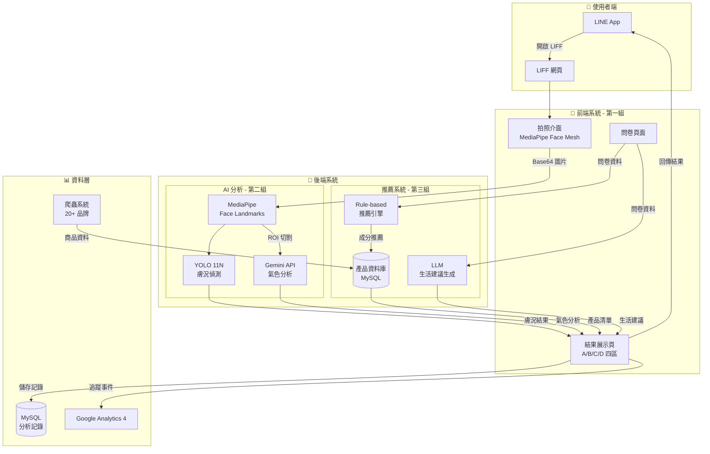

# 🌟 AI 皮膚偵測保養品推薦系統

> 基於 LINE LIFF 的智能美膚分析與個人化推薦系統

## 📋 專案簡介

本專案是一個整合 AI 影像分析、LLM 智能推薦的美膚分析系統。使用者透過 LINE Bot 進入 LIFF 網頁，拍攝臉部照片並填寫問卷後，系統將提供四大分析結果：

### 🎯 四大分析區塊

| 區塊 | 功能 | 技術方案 |
|------|------|----------|
| **A 區：氣色分析** | 分析臉部氣色問題，提供即時改善方案（按摩、呼吸訓練等） | LLM 分析 + Prompt Engineering |
| **B 區：膚況分析** | 偵測臉部特徵問題（斑、痘痘、粉刺、毛孔、細紋、黑眼圈），挑選最嚴重的兩項 | YOLO 11N + MediaPipe Face Mesh |
| **C 區：生活建議** | 根據問卷內容提供飲食與生活習慣建議 | LLM 生成 + Rule-based 邏輯 |
| **D 區：產品推薦** | 推薦適合的保養成分與產品（開架 + 專櫃各 3 項） | Rule-based 推薦系統 + 爬蟲資料 |

---

## 🏗️ 系統架構

---

## 👥 團隊分工

### 第一組：前端 + 系統整合（2 人）
**成員**：江俊穎、陳柏睿

**負責範圍**：
- 📱 LIFF 網頁開發（拍照、問卷、結果頁）
- 🎥 MediaPipe Face Mesh 整合（臉部對齊偵測）
- 🔗 LINE Bot + LIFF 串接
- ☁️ 雲端部署（GCP）
- 🎨 UI/UX 設計與優化
- 🎬 Demo 錄影與簡報素材

**關鍵成果**：
- ✅ 一頁式網頁設計（無卡頓感）
- ✅ MediaPipe 臉部對齊偵測
- ✅ A/B/C/D 四區結果展示頁
- ✅ LINE Bot 已上雲（GCP）
- 🔄 30 天內免問卷機制（開發中）

---

### 第二組：AI 影像分析（3 人）
**成員**：彭昱翔、吳立偉、王儷錡

**負責範圍**：
- 🧠 YOLO 11N 膚況偵測模型訓練
- 📍 MediaPipe Face Mesh ROI 切割
- 🎨 視覺化覆蓋圖（遮罩圖、框線圖）
- 🤖 LLM 氣色分析串接
- 📊 嚴重程度評分系統
- 🚀 Flask/FastAPI 後端 API

**關鍵成果**：
- ✅ 5 種膚況偵測（痘痘、黑眼圈、斑、細紋、毛孔）
- ✅ LLM 氣色分析串接完成
- ✅ 遮罩圖生成完成
- 🔄 粉刺偵測訓練中
- 🔄 API 部署到雲端（進行中）

---

### 第三組：推薦系統 + 資料庫（2 人）
**成員**：蔡佩妤、楊映亭

**負責範圍**：
- 🕷️ 爬蟲系統（20+ 品牌商品資料）
- 🧪 文字標籤提取（關鍵成分、功效）
- 🎯 Rule-based 推薦邏輯
- 💾 MySQL 資料庫設計與建置
- 🤖 LLM 生活建議生成
- 📊 Google Analytics 4 事件追蹤

**關鍵成果**：
- ✅ 爬蟲完成（15 個品牌，5 個被擋）
- ✅ MySQL 資料庫建立完成
- ✅ 商品成分文字標籤提取完成
- ✅ 問卷 JSON schema 完成
- 🔄 推薦 API 開發中

---

## 🔬 A 區：LLM 氣色分析詳細說明

### 偵測機制

LLM 透過分析臉部 ROI 區域的色彩空間特徵，偵測以下氣色問題：

| LLM 偵測特徵 | 氣色問題 | 即時優化方案 | 預期改善指標 (KPI) |
|-------------|---------|-------------|-------------------|
| Lab 色彩空間 L 值降低、R 通道過低 | 臉色蒼白、循環不良 | • 輕拍臉部 • 臉部快速拉提 | 皮膚紅潤度（a* 值）提升 |
| 眼周區域 Delta E 差異大（暗沉） | 眼睛疲勞、靜脈瘀血 | • 眼部冷熱交替 • 眼球運動 | 眼周明亮度提升、色差縮小 |
| 面部地標點下移、嘴角下垂 | 肌肉鬆弛、疲憊神態 | • 嘴角激活訓練 • 臉部拉提按摩 | 嘴角坐標 Y 軸上移、臉部輪廓線提升 |
| 圖像局部對比度過高（紋理深） | 皮膚乾燥、出現乾紋 | • 喝水補充 (Hydration Boost) | 減少細小紋理的視覺噪音 |
| 眉心特徵點緊繃 | 壓力型緊繃、氣色壓抑 | • 深呼吸 (Breathing Reset) | 眉心距離放寬、面部肌肉舒張 |
| 整體亮度分佈不均、眼神光缺失 | 精神萎靡、環境光壓抑 | • 光線刺激 (Light Exposure) | 增加瞳孔反射亮度、提升面部對比度 |
| 頭部與頸部交界處線條模糊 | 淋巴滯留、浮腫 | • 頭皮按摩 • 臉部拉提按摩 | 下顎線清晰度提升 |

### 技術實作

- **LLM 模型**：Gemini API
- **輸入**：MediaPipe Face Mesh 切割的 ROI 區域圖片
- **輸出**：氣色問題分類 + 改善建議 + 預期效果
- **Prompt 設計**：結構化 Prompt，限定輸出格式為 JSON

---

## 🛠️ 技術棧

### 前端技術
- **框架**：HTML5 + CSS3 + JavaScript（一頁式設計）
- **相機**：`getUserMedia()` API
- **臉部偵測**：MediaPipe Face Mesh
- **LINE 整合**：LINE LIFF SDK
- **分析工具**：Google Analytics 4

### 後端技術
- **AI 框架**：
  - YOLO 11N（物件偵測）
  - MediaPipe（臉部特徵點）
  - OpenCV（影像處理）
- **LLM**：Gemini API
- **後端框架**：Flask / FastAPI
- **資料庫**：MySQL
- **爬蟲**：Python（Requests + BeautifulSoup）

### 部署環境
- **雲端平台**：Google Cloud Platform (GCP)
- **容器化**：Docker
- **資料庫**：雲端 MySQL

---

## 📊 開發進度

### ✅ 已完成
- [x] 爬蟲系統（15 個品牌商品資料）
- [x] MySQL 資料庫建置
- [x] MediaPipe Face Mesh 整合
- [x] YOLO 膚況偵測（5 種特徵）
- [x] LLM 氣色分析串接
- [x] 問卷頁面與 JSON schema
- [x] 結果頁 A/B/C/D 四區框架
- [x] LINE Bot 上雲（GCP）
- [x] 粉刺偵測模型訓練
- [x] 推薦 API 完整實作
- [x] AI 分析 API 部署到雲端
- [x] 30 天內免問卷機制
- [x] UI/UX 最終優化（科技感設計）
- [x] 11 張 GIF 圖製作
- [x] 完整系統整合測試
- [x] Demo 流程優化（預設照片切換）
- [x] GA4 事件追蹤完整串接
- [x] 簡報與錄影素材製作
- [x] 最終展示版本部署

---

## 🚀 安裝與部署

### 前置需求
- Python 3.8+
- Node.js 14+
- MySQL 8.0+
- LINE Developer Account
- Google Cloud Platform Account

### 本地開發

#### 1. Clone 專案
\`\`\`bash
git clone <repository-url>
cd cji102_project
\`\`\`

#### 2. 安裝依賴
\`\`\`bash
# Python 依賴
python -m venv .venv
.venv\Scripts\activate  # Windows
pip install -r requirements.txt

# 前端依賴（如有使用 npm）
npm install
\`\`\`

#### 3. 環境變數設定
複製 \`.env.example\` 為 \`.env\` 並填入相關設定：
\`\`\`bash
cp .env.example .env
\`\`\`

#### 4. 資料庫初始化
\`\`\`bash
# 執行資料庫 migration
python database_mysql/init_db.py
\`\`\`

#### 5. 啟動開發伺服器
\`\`\`bash
# 後端 API
python app.py

# 前端（如有使用開發伺服器）
npm run dev
\`\`\`

---

## 📱 Demo 流程

1. **開啟 LINE Bot**：掃描 QR Code 加入官方帳號
2. **進入 LIFF**：點擊「開始分析」按鈕
3. **拍照**：對齊虛線框，確保臉部完整（MediaPipe 會偵測）
4. **填寫問卷**：9 題一頁式問卷（首次使用）
5. **等待分析**：Loading 動畫（約 5-10 秒）
6. **查看結果**：
   - **A 區**：氣色分析 + GIF 示範動作
   - **B 區**：膚況分析 + 覆蓋圖 + 五角圖
   - **C 區**：生活飲食建議
   - **D 區**：產品推薦（可左右滑動）
7. **儲存結果**：點擊「儲存」回傳至 LINE 對話

---

## 📈 商業應用

### 目標客群
- 🏬 美妝品牌（精準推薦）
- 💆 美容院所（膚況追蹤）
- 🏥 皮膚科診所（輔助診斷）
- 🛍️ 電商平台（個人化行銷）

### 核心價值
- **數據驅動**：GA4 追蹤使用者行為，優化推薦邏輯
- **個人化體驗**：結合 AI 分析 + 問卷，精準推薦
- **教育導向**：D 區成分教育，提升使用者認知
- **即時反饋**：A 區提供立即可執行的改善方案

---

## 🎓 專案資訊

- **專案類型**：團隊協作專案
- **團隊人數**：7 人（3 組）
- **開發週期**：2025/12 - 2026/02

---

## 📝 授權

本專案僅供學術用途，未經授權不得用於商業用途。

---

## 🙏 致謝

感謝所有團隊成員的辛勤付出，以及課程老師的指導與建議。

---

**最後更新**：2026-03-13
