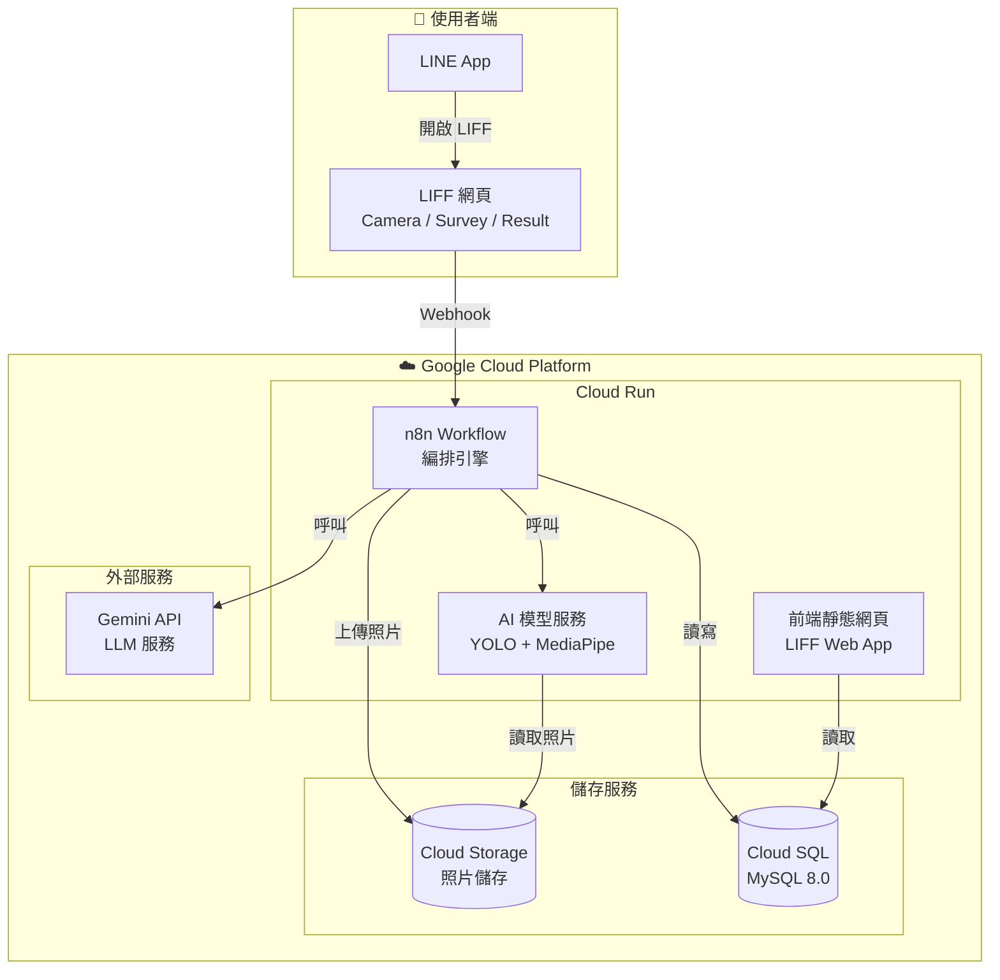
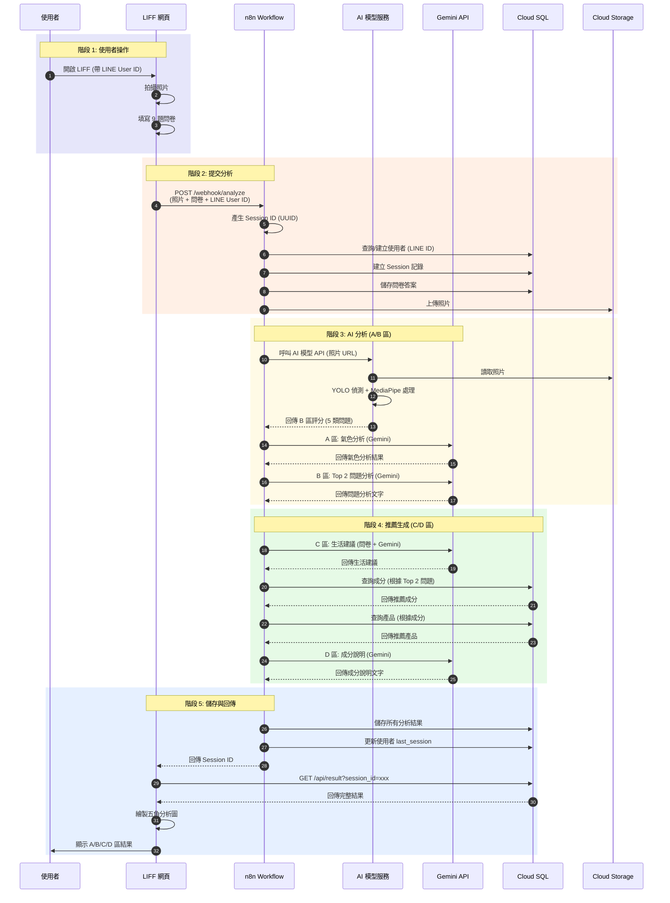
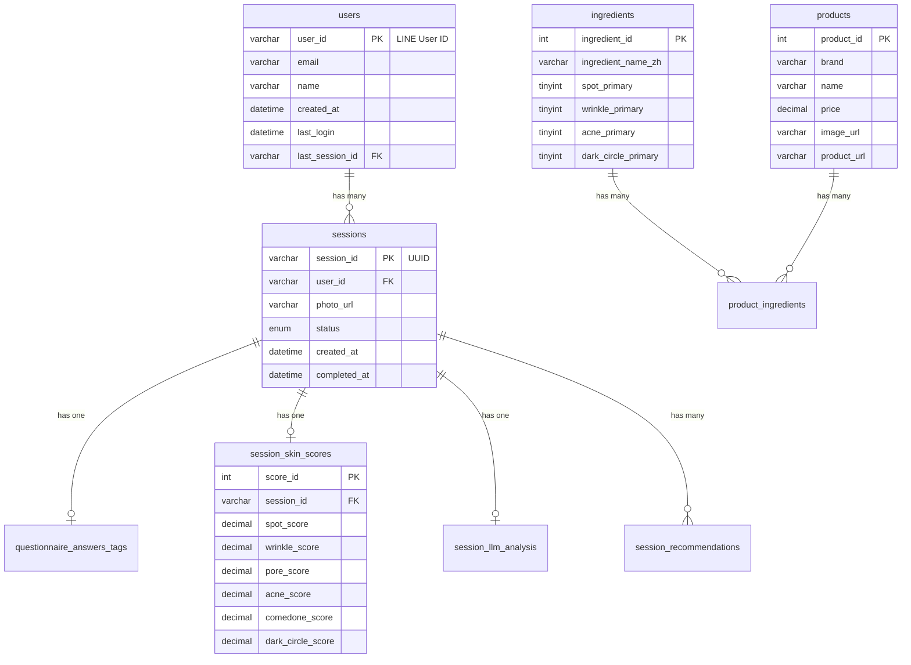
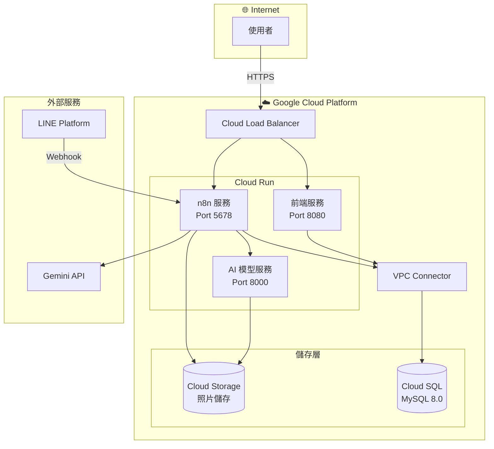
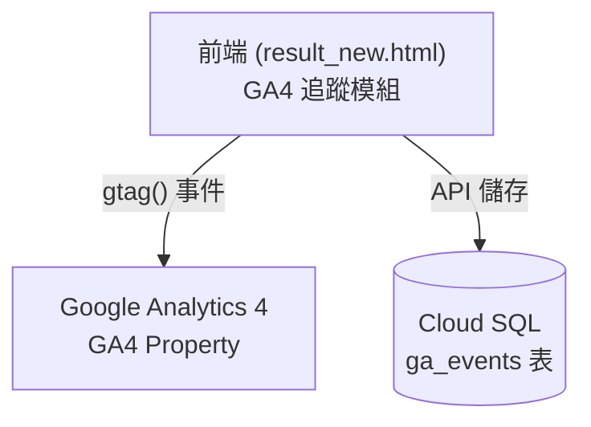

# AI 美膚分析系統 - 系統與軟體架構文檔

> 版本: 1.0 | 更新日期: 2026-01-24

---

## 📋 目錄

1. [系統架構總覽](#1-系統架構總覽)
2. [軟體資料流程](#2-軟體資料流程)
3. [元件詳細說明](#3-元件詳細說明)
4. [API 端點設計](#4-api-端點設計)
5. [資料庫架構](#5-資料庫架構)
6. [部署架構](#6-部署架構)
7. [GA4 埋點追蹤](#7-ga4-埋點追蹤)

---

## 1. 系統架構總覽

### 1.1 高層架構圖



### 1.2 元件清單


| 元件 | 技術 | 部署位置 | 職責 |
|------|------|----------|------|
| **LIFF 網頁** | HTML/CSS/JS | Cloud Run | 拍照、問卷、結果顯示 |
| **n8n** | n8n | Cloud Run | 流程編排、API 呼叫 |
| **AI 模型服務** | Python/Flask | Cloud Run | YOLO 偵測、MediaPipe 處理 |
| **Gemini API** | Google AI | 外部服務 | LLM 文字生成 (A/B/C/D 區) |
| **Cloud SQL** | MySQL 8.0 | GCP | 資料儲存 |
| **Cloud Storage** | GCS | GCP | 照片儲存 |

---

## 2. 軟體資料流程

### 2.1 完整資料流程圖



### 2.2 n8n Workflow 內部流程

**n8n Master Workflow 執行步驟:**

1. **Webhook Trigger** - 接收照片+問卷+LINE ID
2. **查詢/建立使用者** - 判斷是否首次使用
3. **建立 Session** - 產生 UUID
4. **儲存問卷答案** - 到資料庫
5. **上傳照片** - 到 GCS
6. **呼叫 AI 模型** - 取得 B 區評分
7. **呼叫 Gemini** - A 區氣色分析
8. **呼叫 Gemini** - B 區問題分析
9. **呼叫 Gemini** - C 區生活建議
10. **查詢成分+產品** - D 區推薦
11. **呼叫 Gemini** - D 區成分說明
12. **儲存所有結果** - 到資料庫
13. **更新 last_session** - 更新使用者最後會話
14. **回傳 Session ID** - 給前端

---

## 3. 元件詳細說明

### 3.1 LIFF 前端

**部署**: GCP Cloud Run

**頁面結構**:
- `index.html` - 入口頁,導向拍照
- `analyze.html` - 拍照頁 (MediaPipe 臉部偵測)
- `survey_new.html` - 9 題問卷頁
- `result_new.html` - 結果展示頁 (A/B/C/D 區)

**前端職責**:

| 功能 | 說明 |
|------|------|
| LIFF 初始化 | 取得 LINE User ID |
| 臉部偵測 | MediaPipe Face Mesh (品質檢測) |
| 問卷收集 | 9 題選擇題 |
| 呼叫 n8n | 提交照片 + 問卷 |
| 取得結果 | 用 Session ID 從資料庫取結果 |
| 繪製圖表 | B 區五角分析圖 (Canvas) |
| 顯示內容 | A/B/C/D 區動態渲染 |

### 3.2 n8n Workflow

**部署**: GCP Cloud Run

**職責**:

| 功能 | 說明 |
|------|------|
| 流程編排 | 協調所有 API 呼叫 |
| 使用者管理 | 查詢/建立使用者、判斷首次使用 |
| Session 管理 | 建立 Session、更新 last_session |
| 資料儲存 | 將所有結果存入資料庫 |
| LLM 呼叫 | 呼叫 Gemini API (A/B/C/D 區) |
| 推薦查詢 | 查詢成分和產品 |

### 3.3 AI 模型服務

**部署**: GCP Cloud Run (Python Flask/FastAPI)

**職責**:

| 功能 | 輸入 | 輸出 |
|------|------|------|
| 膚況偵測 | 照片 URL | 5 類問題評分 (0-10) |
| ROI 切割 | 照片 URL | 臉部區域圖片 |

**使用的模型**:
- **YOLO 11N**: 偵測痘痘、斑、粉刺、黑眼圈、毛孔
- **MediaPipe Face Mesh**: 臉部特徵點、ROI 切割

### 3.4 Gemini API (LLM)

**用途對應**:

| 區塊 | Prompt 輸入 | 輸出 |
|------|-------------|------|
| **A 區** | 臉部 ROI + 問卷 | 氣色分析 + 偵測問題 ID |
| **B 區** | 5 類評分 + Top 2 問題 | 問題分析文字 |
| **C 區** | 9 題問卷答案 | 生活建議 (飲食/睡眠/運動) |
| **D 區** | Top 2 問題 + 成分列表 | 成分說明文字 |

---

## 4. API 端點設計

### 4.1 n8n Webhook (前端提交分析)


| 方法 | 端點 | 說明 |
|------|------|------|
| `POST` | `/webhook/analyze` | 主要分析 API |

**Request**:
```json
{
  "photo": "base64_string",
  "line_user_id": "U1234567890",
  "answers": ["選項A", "選項B", ...]
}
```

**Response**:
```json
{
  "success": true,
  "session_id": "uuid-xxx-xxx"
}
```

### 4.2 取得結果 API (前端取得結果)


| 方法 | 端點 | 說明 |
|------|------|------|
| `GET` | `/api/result?session_id=xxx` | 取得分析結果 |

**Response**:
```json
{
  "session_id": "uuid-xxx",
  "llm_detection": {
    "summary": "...",
    "detectedIssues": [1, 4]
  },
  "b_scores": {
    "darkCircles": 7.8,
    "acne": 6.1,
    "comedones": 5.4,
    "wrinkles": 4.2,
    "spots": 6.9
  },
  "b_top_issues": [...],
  "lifestyle_advice": {...},
  "d_product_recommendations": {...}
}
```

### 4.3 AI 模型 API (n8n 呼叫)


| 方法 | 端點 | 說明 |
|------|------|------|
| `POST` | `/api/analyze-skin` | 膚況分析 |

**Request**:
```json
{
  "photo_url": "gs://bucket/photo.jpg"
}
```

**Response**:
```json
{
  "b_scores": {
    "darkCircles": 7.8,
    "acne": 6.1,
    "comedones": 5.4,
    "wrinkles": 4.2,
    "spots": 6.9
  },
  "top_issues": ["darkCircles", "spots"]
}
```

---

## 5. 資料庫架構

### 5.1 ER Diagram



### 5.2 資料表分類

#### 靜態資料表 (預先匯入)

| 資料表 | 說明 | 預估筆數 |
|--------|------|----------|
| `ingredients` | 成分表 | ~35 |
| `products` | 產品表 | ~432 |
| `product_ingredients` | 成分產品關聯 | ~1,370 |
| `actions` | 氣色行動建議 | ~10 |

#### 動態資料表 (使用者產生)

| 資料表 | 說明 | 寫入時機 |
|--------|------|----------|
| `users` | 使用者表 | 首次使用時 |
| `sessions` | 分析會話 | 每次分析 |
| `questionnaire_answers_tags` | 問卷答案 | 每次分析 |
| `session_skin_scores` | 模型評分結果 | 每次分析 |
| `session_llm_analysis` | LLM 生成文字 | 每次分析 |
| `session_recommendations` | 推薦結果 | 每次分析 |

---

## 6. 部署架構

### 6.1 GCP 部署圖



### 6.2 服務配置


| 服務 | CPU | 記憶體 | 最小實例 | 最大實例 |
|------|-----|--------|----------|----------|
| 前端服務 | 1 | 256MB | 0 | 10 |
| n8n 服務 | 2 | 1GB | 1 | 5 |
| AI 模型服務 | 4 | 4GB | 0 | 3 |

---

## 7. GA4 埋點追蹤

### 7.1 追蹤架構



### 7.2 追蹤事件列表


| 事件名稱 | 資料類型 | 說明 |
|----------|---------|------|
| `overview_duration` | number (秒) | 使用者在總覽頁停留時間 |
| `section_a_duration` | number (秒) | 使用者在 A 區 (氣色分析) 停留時間 |
| `section_b_duration` | number (秒) | 使用者在 B 區 (膚況分析) 停留時間 |
| `section_c_duration` | number (秒) | 使用者在 C 區 (生活建議) 停留時間 |
| `section_d_duration` | number (秒) | 使用者在 D 區 (產品推薦) 停留時間 |
| `clicked_products` | array | 使用者點擊的產品 ID 列表 |
| `products_click_count` | number | 使用者點擊產品的次數 |
| `exit_method` | string | 離開頁面的方式 (例: back_button, line_close, save_result) |
| `exit_time` | datetime | 離開頁面的時間 |

### 7.3 事件追蹤實作

#### 前端追蹤程式碼:
```javascript
// 追蹤區塊停留時間
let sectionTimers = {};

function trackSectionStart(sectionName) {
    sectionTimers[sectionName] = Date.now();
}

function trackSectionEnd(sectionName) {
    if (sectionTimers[sectionName]) {
        const duration = (Date.now() - sectionTimers[sectionName]) / 1000;
        gtag('event', `${sectionName}_duration`, {
            'value': duration,
            'session_id': sessionId
        });
    }
}

// 追蹤產品點擊
function trackProductClick(productId) {
    clickedProducts.push(productId);
    gtag('event', 'product_click', {
        'product_id': productId,
        'session_id': sessionId
    });
}

// 離開頁面時儲存到資料庫
window.addEventListener('beforeunload', () => {
    saveGAEventsToDB({
        session_id: sessionId,
        overview_duration: sectionTimers.overview,
        section_a_duration: sectionTimers.section_a,
        section_b_duration: sectionTimers.section_b,
        section_c_duration: sectionTimers.section_c,
        section_d_duration: sectionTimers.section_d,
        clicked_products: clickedProducts,
        products_click_count: clickedProducts.length,
        exit_method: getExitMethod(),
        exit_time: new Date().toISOString()
    });
});
```

### 7.4 ga_events 資料表結構

```sql
CREATE TABLE ga_events (
    event_id INT PRIMARY KEY AUTO_INCREMENT,
    session_id VARCHAR(50),
    user_id VARCHAR(50),
    overview_duration DECIMAL(10,2),
    section_a_duration DECIMAL(10,2),
    section_b_duration DECIMAL(10,2),
    section_c_duration DECIMAL(10,2),
    section_d_duration DECIMAL(10,2),
    clicked_products JSON,
    products_click_count INT,
    exit_method VARCHAR(50),
    exit_time DATETIME,
    created_at DATETIME DEFAULT CURRENT_TIMESTAMP,
    FOREIGN KEY (session_id) REFERENCES sessions(session_id),
    FOREIGN KEY (user_id) REFERENCES users(user_id)
);
```

### 7.5 資料分析用途


| 指標 | 分析目的 |
|------|---------|
| **區塊停留時間** | 了解使用者對哪個區塊最感興趣 |
| **產品點擊** | 分析熱門產品、優化推薦算法 |
| **離開方式** | 了解使用者行為模式、優化 UX |
| **退出時間** | 分析使用高峰時段 |

---

## 📝 待確認事項

> [!IMPORTANT]
> 以下為本文檔的設計假設,需與團隊確認:

1. **使用者判斷邏輯**: n8n 用 LINE ID 查詢 users 表,不存在則建立
2. **last_session 更新**: n8n 在完成分析後更新 users.last_session_id
3. **問卷資料來源**: 前端提交時直接傳給 n8n
4. **前端 API 數量**: 2 個 (POST 提交分析 + GET 取得結果)
