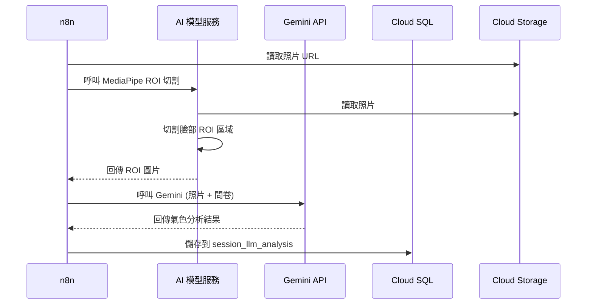
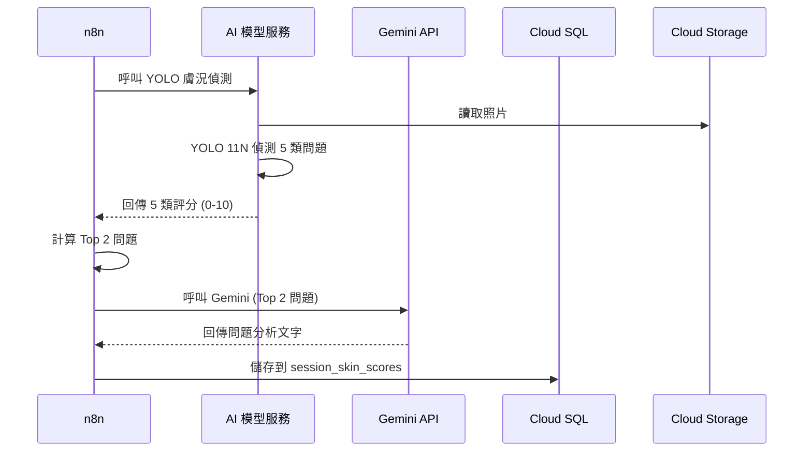
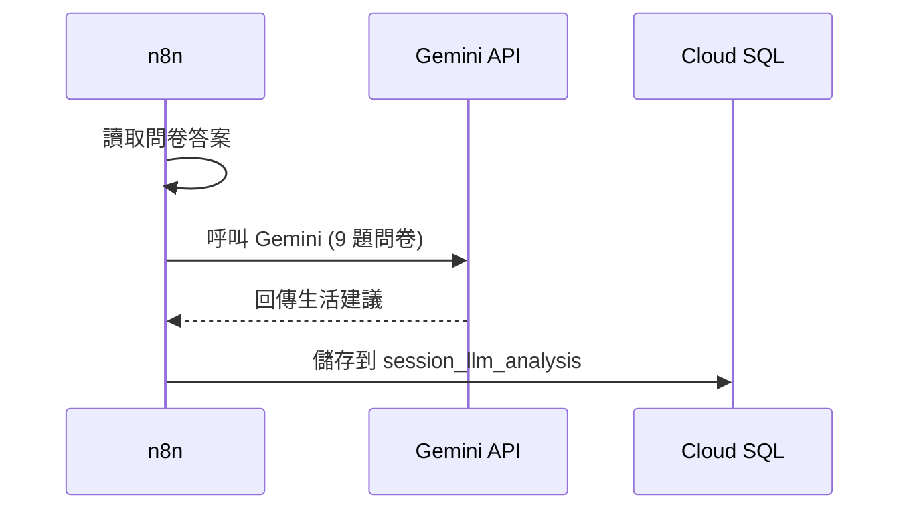
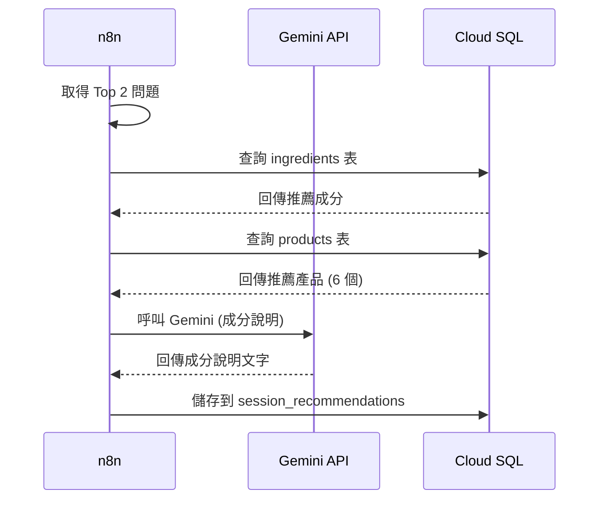

# AI 美膚分析系統 - 分區軟體架構

> 版本: 1.0 | 更新日期: 2026-01-24

---

## 📋 目錄

1. [整體流程概覽](#1-整體流程概覽)
2. [A 區:氣色分析流程](#2-a-區氣色分析流程)
3. [B 區:膚況分析流程](#3-b-區膚況分析流程)
4. [C 區:生活建議流程](#4-c-區生活建議流程)
5. [D 區:產品推薦流程](#5-d-區產品推薦流程)
6. [資料儲存流程](#6-資料儲存流程)

---

## 1. 整體流程概覽

### 1.1 使用者操作流程

```
使用者 (LINE)
    ↓
開啟 LIFF 網頁
    ↓
拍攝照片 (MediaPipe 品質檢測)
    ↓
填寫 9 題問卷
    ↓
提交分析 (POST /webhook/analyze)
    ↓
等待 5-10 秒
    ↓
查看結果 (GET /api/result)
    ↓
顯示 A/B/C/D 區結果
```

### 1.2 n8n 處理流程

```
1. 接收請求 (照片 + 問卷 + LINE User ID)
2. 查詢/建立使用者
3. 建立 Session (UUID)
4. 儲存問卷答案
5. 上傳照片到 GCS
   ↓
6-8.  處理 A/B 區 (AI 分析)
9.    處理 C 區 (生活建議)
10-11. 處理 D 區 (產品推薦)
   ↓
12. 儲存所有結果
13. 更新 last_session
14. 回傳 Session ID
```

---

## 2. A 區:氣色分析流程

### 2.1 資料流程



### 2.2 輸入資料


| 資料項目 | 來源 | 說明 |
|---------|------|------|
| 臉部 ROI 圖片 | AI 模型切割 | MediaPipe 切割的臉部區域 |
| 問卷答案 | 前端提交 | 9 題問卷的答案 |

### 2.3 LLM Prompt 結構

```
輸入:
- 臉部 ROI 圖片
- 使用者問卷答案 (睡眠、飲食、壓力等)

輸出:
{
  "summary": "您的氣色整體良好...",
  "detectedIssues": [1, 4]  // 偵測到的問題 ID
}
```

### 2.4 輸出資料


| 資料項目 | 格式 | 用途 |
|---------|------|------|
| summary | string | 氣色總評文字 |
| detectedIssues | array | 偵測到的問題 ID (對應 actions 表) |

### 2.5 前端顯示

- 顯示 LLM 生成的氣色分析文字
- 根據 `detectedIssues` 顯示對應的行動建議 (按摩、呼吸訓練等)
- 播放教學影片 (MP4) 或顯示示範圖片 (PNG)

---

## 3. B 區:膚況分析流程

### 3.1 資料流程



### 3.2 輸入資料


| 資料項目 | 來源 | 說明 |
|---------|------|------|
| 照片 URL | GCS | 使用者上傳的照片 |

### 3.3 AI 模型處理

**YOLO 11N 偵測 5 類問題:**

| 問題類型 | 評分範圍 | 說明 |
|---------|---------|------|
| 黑眼圈 (darkCircles) | 0-10 | 10 = 最嚴重 |
| 痘痘 (acne) | 0-10 | 10 = 最嚴重 |
| 粉刺 (comedones) | 0-10 | 10 = 最嚴重 |
| 細紋 (wrinkles) | 0-10 | 10 = 最嚴重 |
| 斑 (spots) | 0-10 | 10 = 最嚴重 |

### 3.4 LLM 分析

```
輸入:
- Top 2 問題名稱和分數
- 例如: 黑眼圈 (7.8), 斑 (6.9)

輸出:
[
  {
    "name": "黑眼圈",
    "score": 7.8,
    "llm_analysis": "眼周區域循環不佳,靜脈瘀血較為明顯..."
  },
  {
    "name": "斑",
    "score": 6.9,
    "llm_analysis": "臉頰區域色素沉澱,可能與日曬有關..."
  }
]
```

### 3.5 前端顯示

- 繪製五角分析圖 (Canvas)
- 顯示 Top 2 問題卡片 (含嚴重度標籤和顏色)
- 顯示 LLM 生成的問題分析文字
- 顯示溫馨提醒

---

## 4. C 區:生活建議流程

### 4.1 資料流程



### 4.2 輸入資料


| 資料項目 | 來源 | 說明 |
|---------|------|------|
| 問卷答案 | 前端提交 | 9 題問卷的答案 (睡眠、飲食、運動等) |

### 4.3 LLM Prompt 結構

```
輸入:
- 問題 1: 睡眠狀況 → 答案: "經常熬夜"
- 問題 2: 飲食習慣 → 答案: "飲食不均衡"
- 問題 3: 運動頻率 → 答案: "很少運動"
- ... (共 9 題)

輸出:
{
  "nutrition": {
    "summary": "增加蔬果、減少油炸",
    "detail": "建議每天攝取 5 份蔬果...",
    "items": ["深綠色蔬菜", "Omega-3 食物", ...]
  },
  "sleep": {
    "summary": "每晚 7-8 小時睡眠",
    "detail": "建議固定就寢時間..."
  },
  "exercise": {
    "summary": "每週至少 3 次運動",
    "detail": "保持規律運動..."
  }
}
```

### 4.4 輸出資料


| 資料項目 | 格式 | 用途 |
|---------|------|------|
| nutrition | object | 營養補充建議 |
| sleep | object | 作息調整建議 |
| exercise | object | 生活習慣改善 |

### 4.5 前端顯示

- 顯示營養補充建議 (列表)
- 顯示作息調整建議 (文字)
- 顯示生活習慣改善 (文字)

---

## 5. D 區:產品推薦流程

### 5.1 資料流程



### 5.2 資料庫查詢邏輯

**步驟 1: 查詢成分**

```sql
SELECT 
  ingredient_id,
  ingredient_name_zh,
  dark_circle_primary,
  spot_primary
FROM ingredients
WHERE 
  (dark_circle_primary = 1 AND 'darkCircles' IN (:top_issues))
  OR (spot_primary = 1 AND 'spots' IN (:top_issues))
```

**步驟 2: 查詢產品**

```sql
SELECT DISTINCT
  p.product_id,
  p.name,
  p.brand,
  p.price,
  p.image_url,
  p.product_url
FROM products p
JOIN product_ingredients pi ON p.product_id = pi.product_id
WHERE pi.ingredient_id IN (:ingredient_ids)
ORDER BY p.price ASC
LIMIT 6
```

### 5.3 LLM 成分說明

```
輸入:
- Top 2 問題: ["黑眼圈", "斑"]
- 推薦成分: ["咖啡因", "維生素C"]

輸出:
[
  {
    "issue_name": "黑眼圈",
    "primary_ingredient": "咖啡因",
    "core_ingredients": ["維生素K", "煙醯胺"],
    "description": "咖啡因能促進眼周血液循環..."
  },
  {
    "issue_name": "斑",
    "primary_ingredient": "維生素C",
    "core_ingredients": ["熊果素", "煙醯胺"],
    "description": "維生素C能抑制黑色素生成..."
  }
]
```

### 5.4 輸出資料


| 資料項目 | 格式 | 用途 |
|---------|------|------|
| ingredients | array | 成分說明列表 |
| products | array | 產品推薦列表 (6 個) |

### 5.5 前端顯示

- 顯示成分說明卡片 (針對 Top 2 問題)
- 顯示產品推薦卡片 (橫向滑動,6 個產品)
- 產品卡片包含:圖片、品牌、名稱、價格、連結

---

## 6. 資料儲存流程

### 6.1 儲存時機

```
n8n 完成所有分析後 (步驟 12-13):
  ↓
儲存到 Cloud SQL
  ├─ session_llm_analysis (A/C 區 LLM 結果)
  ├─ session_skin_scores (B 區評分)
  ├─ session_recommendations (D 區推薦)
  └─ users.last_session_id (更新最後會話)
```

### 6.2 資料表對應


| 區塊 | 資料表 | 儲存內容 |
|------|--------|---------|
| A 區 | session_llm_analysis | 氣色分析結果 + 偵測問題 ID |
| B 區 | session_skin_scores | 5 類問題評分 |
| B 區 | session_llm_analysis | Top 2 問題分析文字 |
| C 區 | session_llm_analysis | 生活建議 (nutrition/sleep/exercise) |
| D 區 | session_recommendations | 推薦成分 + 產品列表 |

### 6.3 前端取得結果

```
前端收到 session_id 後:
  ↓
呼叫 GET /api/result?session_id=xxx
  ↓
從 Cloud SQL 讀取所有結果
  ↓
回傳完整 JSON 給前端
  ↓
前端動態渲染 A/B/C/D 區
```

---

## 📝 總結

### 各區塊技術方案


| 區塊 | 主要技術 | LLM 用途 | 資料來源 |
|------|---------|---------|---------|
| **A 區** | MediaPipe + Gemini | 氣色分析 + 問題偵測 | 照片 ROI + 問卷 |
| **B 區** | YOLO 11N + Gemini | Top 2 問題分析文字 | 照片 |
| **C 區** | Gemini | 生活建議生成 | 9 題問卷 |
| **D 區** | MySQL + Gemini | 成分說明文字 | Top 2 問題 + 資料庫 |

### 資料流向


```
前端 → n8n → AI 模型 → n8n → Gemini → n8n → MySQL → 前端
```
